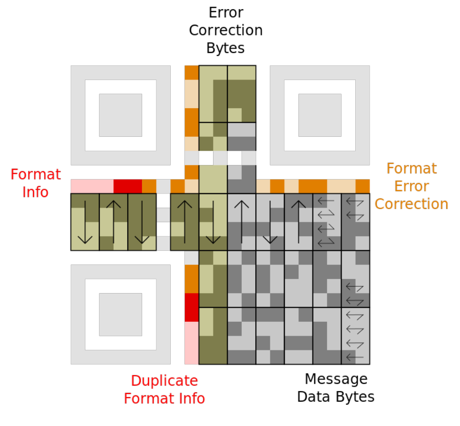
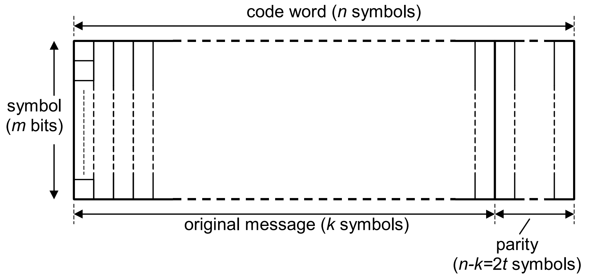

# 纠删码技术

## 目录

<!-- TOC depthfrom:2 -->
- [纠删码技术](#纠删码技术)
	- [目录](#目录)
	- [纠删码简介](#纠删码简介)
	- [纠删码相关代码](#纠删码相关代码)
		- [minio erasure:](#minio-erasure)
		- [filecoin erasure:](#filecoin-erasure)
		- [storj erasure:](#storj-erasure)
		- [hadoop/glusterfs企业版本 erasure:](#hadoopglusterfs企业版本-erasure)
			- [功能介绍](#功能介绍)
			- [源码实现](#源码实现)
	- [原型验证](#原型验证)
	- [参考资料](#参考资料)

<!-- /TOC -->

## 纠删码简介
纠删码（erasure coding，EC）是一种数据保护方法，它将数据分割成片段，把冗余数据块扩展、编码，并将其存储在不同的位置，比如磁盘、存储节点或者其它地理位置。  
> 纠删码码广泛用于数据存储（如CD）和传输应用中。在信道编码中，差错控制编码根据编码用途不同，可以分为检错码、纠错码和纠删码三种。 
>> 检错码是为了校验数据经过信道传输后是否出现了错误，常用的检错码包括简单奇偶校验码、循环冗余校验码等。  
>> 纠错码不仅可以识别到信道传输是否出现了错误，还能纠正传输错误。在纠错码看来，经过差错信道传输后，接收端收到的数据都是不可靠的，需要通过解码来发现和纠正错误。前向纠错（Forward Error Correction ，简称FEC）或信道编码是一种用于在不可靠或有噪声的通信信道上控制数据传输错误的技术。中心思想是发送者以冗余的方式对消息进行编码，通常使用纠错码（Error Correction Code，简称ECC）。常见的纠错码包括海明码（Hamming Code）、BCH码等.  
>> 纠删码可以认为是一种特殊的纠错码，对于纠删码来说，其差错信道是一种删除信道，对接收者来说错误的位置是已知的，并且收到的数据都认为是正确的，因此其编译码会比纠错码更容易一些。   
示例,QR码采用纠错算法生成一系列纠错码字，添加在数据码字序列之后，使得符号可以在遇到损坏时可以恢复。QR 码的纠错使用 Reed–Solomon 编码

RS码是一种纠错性能很强的线性纠错码，一类重要的线性分组码，也是一种性能优异的短码，工作在有限域上，能够纠正随机错误和突发错误. RS编码会将需要编码的流数据重新排列为以「符号(symbol)」为单位的数据块,如下图所示：

以RS（544，514，15，10）表示方式举例，每个符号Symbol数据位宽位10位（m=10bits），原始数据为514个符号（k=514），校验数据为30个Symbol（t=15），最终编码完成后符号总数为544个Symbol（n=544）。

 线性分组码通常用(n,k)码来表示，对于位编码来说，k和n表示比特数，其中k为信息位个数，n为码长；对于码长为n的RS纠删码来说，只要收到任意k个信息位，就可以解码出所有n个数据。
	对于一个(n,k)线性纠删码，可以表示为如下的矩阵运算： Y = x * G
其中，x是信息位向量，y是码字向量，G是生成矩阵。 在RS码中，常见的生成矩阵有范德蒙矩阵和柯西矩阵，分别如下图所示，这两种矩阵的特点是任意子矩阵均可逆，因此总能利用任意k个接收码字来解码出剩余n-k个码字。 
RS码通过生成(irreducible generator)和分解(dividing)多项式来表达信息，分解余下的多项式(remainder)就是RS码, IEEE 802.3 119.2.4.6中定义了编码的算法：数据分块采用多项式表示：原始数据块m,校验块k(2t=m=4)，经过编码后的数据为Symbol(m + k )，表示如下：

$$(m_{k-1} x^{k-1} + \cdots + m_1x + m_0) \times x^{2t}$$

并根据校验块的方式进行后补零
$$m_{k-1} x^{n-1} + \cdots + m_1x^{2t+1} + m_0x^{2t} + 0x^{2t-1} + \cdots + 0x +0$$

<!-- $$ \sum_{i=1}^n \frac{1}{i^2}$$ -->
<!-- $$ g(x) = \prod_{j=0}^{2t-1} \frac{1}{i^2}$$ -->

生成多项式g(x)的(生成多项式(generator polynomial)就是我们编码用的字典，而用它除原信息多项式的运算就是我们加密（RS编码）的过程)如下：

$$ g(x) = \frac{1}{\vec{a}}\prod_{j=0}^{2t-1} (x - a^j) = \frac{1}{\vec{a}} (g_{2t}x^{2t} + \cdot + g_1x + g_0)$$

数据多项式除以生成多项式g(x)  取余下的多项式为校验多项式 p(x)。
$$m_{k-1} x^{n-1} + \cdots + m_1x^{2t+1} + m_0x^{2t} + p_{2t-1}x^{2t-1} + \cdots + p_1x +p_0$$


<!-- 如果传输过程没有任何错误，那么接收到的编码数据块多项式去除生成多项式  是可以整除、没有余数的，如下图所示： -->
$$m_{k-1} x^{n-1} + \cdots + m_1x^{2t+1} + m_0x^{2t} + p_{2t-1}x^{2t-1} + \cdots + p_1x +p_0 \div \prod_{j=0}^{2t-1} (x - a^j) = \vec{a}$$


## 纠删码相关代码

### minio erasure:
基于github.com/klauspost/reedsolomon实现

```bash
(base) ➜  codeshow git:(main) ✗ ls  http://github.com/minio/minio/cmd/erasure* 
http://github.com/minio/minio/cmd/erasure-bucket.go
http://github.com/minio/minio/cmd/erasure-coding.go
http://github.com/minio/minio/cmd/erasure-common.go
http://github.com/minio/minio/cmd/erasure-decode.go
http://github.com/minio/minio/cmd/erasure-decode_test.go
http://github.com/minio/minio/cmd/erasure-encode.go
http://github.com/minio/minio/cmd/erasure-encode_test.go
http://github.com/minio/minio/cmd/erasure-errors.go
http://github.com/minio/minio/cmd/erasure-heal_test.go
http://github.com/minio/minio/cmd/erasure-healing-common.go
http://github.com/minio/minio/cmd/erasure-healing-common_test.go
http://github.com/minio/minio/cmd/erasure-healing.go
http://github.com/minio/minio/cmd/erasure-healing_test.go
http://github.com/minio/minio/cmd/erasure-metadata-utils.go
http://github.com/minio/minio/cmd/erasure-metadata-utils_test.go
http://github.com/minio/minio/cmd/erasure-metadata.go
http://github.com/minio/minio/cmd/erasure-metadata_test.go
http://github.com/minio/minio/cmd/erasure-multipart.go
http://github.com/minio/minio/cmd/erasure-object.go
http://github.com/minio/minio/cmd/erasure-object_test.go
http://github.com/minio/minio/cmd/erasure-server-pool-decom.go
http://github.com/minio/minio/cmd/erasure-server-pool-decom_gen.go
http://github.com/minio/minio/cmd/erasure-server-pool-decom_gen_test.go
http://github.com/minio/minio/cmd/erasure-server-pool-decom_test.go
http://github.com/minio/minio/cmd/erasure-server-pool.go
http://github.com/minio/minio/cmd/erasure-sets.go
http://github.com/minio/minio/cmd/erasure-sets_test.go
http://github.com/minio/minio/cmd/erasure-utils.go
http://github.com/minio/minio/cmd/erasure.go # 定义ER对象
http://github.com/minio/minio/cmd/erasure_test.go # 测试代码
```


[纠删码入口](../../../../code/minio/cmd/erasure.go)
定义ER对象
```go
// erasureObjects - Implements ER object layer.
type erasureObjects struct {
	GatewayUnsupported

	setDriveCount      int //节点数量
	defaultParityCount int //默认分区

	setIndex  int
	poolIndex int

	// getDisks returns list of storageAPIs.
	getDisks func() []StorageAPI

	// getLockers returns list of remote and local lockers.
	getLockers func() ([]dsync.NetLocker, string)

	// getEndpoints returns list of endpoint strings belonging this set.
	// some may be local and some remote.
	getEndpoints func() []Endpoint

	// Locker mutex map.
	nsMutex *nsLockMap

	// Byte pools used for temporary i/o buffers.
	bp *bpool.BytePoolCap

	// Byte pools used for temporary i/o buffers,
	// legacy objects.
	bpOld *bpool.BytePoolCap

	deletedCleanupSleeper *dynamicSleeper
}

```
[RS纠删码](../../../../code/minio/cmd/erasure-coding.go)
```go
// 定义reedsolomon.Encoder编码，引用"github.com/klauspost/reedsolomon"
// Erasure - erasure encoding details.
type Erasure struct {
	encoder                  func() reedsolomon.Encoder
	dataBlocks, parityBlocks int
	blockSize                int64
}
```

[数据对象](../../../../code/minio/cmd/erasure-object.go)
定义了数据对象操作方法列表


[数据集](../../../../code/minio/cmd/erasure-set.go)

```go
// setsDsyncLockers is encapsulated type for Close()
type setsDsyncLockers [][]dsync.NetLocker

// erasureSets implements ObjectLayer combining a static list of erasure coded
// object sets. NOTE: There is no dynamic scaling allowed or intended in
// current design.
type erasureSets struct {
	GatewayUnsupported

	sets []*erasureObjects

	// Reference format.
	format *formatErasureV3
	>>>>
}
	
```

[服务资源池](../../../../code/minio/cmd/erasure-server-pool.go)
```go

type erasureServerPools struct {
	GatewayUnsupported

	poolMetaMutex sync.RWMutex
	poolMeta      poolMeta
	serverPools   []*erasureSets

	// Shut down async operations
	shutdown context.CancelFunc

	// Active decommission canceler
	decommissionCancelers []context.CancelFunc
}
```

[编码过程](../../../../code/minio/cmd/erasure-encode.go)
关键数据结构parallelWriter，包括writers和quorum，其中quorum = erasure.dataBlocks+1
```go
// Encode reads from the reader, erasure-encodes the data and writes to the writers.
func (e *Erasure) Encode(ctx context.Context, src io.Reader, writers []io.Writer, buf []byte, quorum int) (total int64, err error) {
	writer := &parallelWriter{
		writers:     writers,
		writeQuorum: quorum,
		errs:        make([]error, len(writers)),
	}
}
```
[解码过程](../../../../code/minio/cmd/erasure-decode.go)

```go
unc (e Erasure) Decode(ctx context.Context, writer io.Writer, readers []io.ReaderAt, offset, length, totalLength int64, prefer []bool) (written int64, derr error) {
	if offset < 0 || length < 0 {
		logger.LogIf(ctx, errInvalidArgument)
		return -1, errInvalidArgument
	}
}
```

[元数据处理](../../../../code/minio/cmd/erasure-metadata.go)
1. 元数据处理算法
```go
// Object was stored with additional erasure codes due to degraded system at upload time
const minIOErasureUpgraded = "x-minio-internal-erasure-upgraded"

const erasureAlgorithm = "rs-vandermonde"
```
2. 元数据结构
```go
// ToObjectInfo - Converts metadata to object info.
func (fi FileInfo) ToObjectInfo(bucket, object string) ObjectInfo {
	object = decodeDirObject(object)
	versionID := fi.VersionID
	if (globalBucketVersioningSys.Enabled(bucket) || globalBucketVersioningSys.Suspended(bucket)) && versionID == "" {
		versionID = nullVersionID
	}

	objInfo := ObjectInfo{
		IsDir:            HasSuffix(object, SlashSeparator),
		Bucket:           bucket,
		Name:             object,
		VersionID:        versionID,
		IsLatest:         fi.IsLatest,
		DeleteMarker:     fi.Deleted,
		Size:             fi.Size,
		ModTime:          fi.ModTime,
		Legacy:           fi.XLV1,
		ContentType:      fi.Metadata["content-type"],
		ContentEncoding:  fi.Metadata["content-encoding"],
		NumVersions:      fi.NumVersions,
		SuccessorModTime: fi.SuccessorModTime,
	}
```

[数据恢复](../../../../code/minio/cmd/erasure-healing.go)

### filecoin erasure:
无公开资料显示支持纠删码

### storj erasure:

1. 文档（蓝皮书）：docs/blueprints/audit-v2.md
2. 编码： https://github.com/storj/storj/blob/master/satellite/metainfo/endpoint.go
3. 修复： https://github.com/storj/storj/blob/master/satellite/reparir/repairer/ec.go
4. 

### hadoop/glusterfs企业版本 erasure:
1. 纠删码是hadoop3.x新加入的功能

#### 功能介绍
纠删码则可以在同等可用性的情况下，节省更多的空间，纠删码可以将HDFS的存储开销降低约50%，同时与三份副本策略一样，还可以保证数据的可用性。目前默认的纠删码策略一共有5种，包括RS-10-4-1024k，RS-3-2-1024k，RS-6-3-1024k，RS-LEGACY-6-3-1024k和XOR-2-1-1024k。

以RS-6-3-1024K这种纠删码策略为例子,6份原始数据，编码后生成3份校验数据，一共9份数据，只要最终有6份数据存在，就可以得到原始数据，它可以容忍任意3份数据不可用.

```bash
#开启
hdfs ec -enablePolicy -policy RS-3-2-1024k
 
#禁用
hdfs ec -disablePolicy -policy RS-3-2-1024k

# 在HDFS创建目录，并设置/input擦除策略
# 纠删码策略是与具体的路径（path）相关联的。也就是说，如果我们要使用纠删码，则要给一个具体的路径设置纠删码策略，后续，所有往此目录下存储的文件，都会执行此策略。默认只开启对RS-6-3-1024k策略的支持
#目录创建
hdfs dfs -mkdir /input
 
#为input目录设置策略
hdfs ec -setPolicy -path /input -policy RS-3-2-1024k
 
#获取目录的纠删码策略
hdfs ec -getPolicy -path /input

```

#### 源码实现
https://github.com/apache/hadoop/hadoop-common-project/hadoop-common/src/main/java/org/apache/hadoop/io/erasurecode/ECSchema.java

2. glusterfs企业版本（红帽）

在GlusterFS 3.6版本中发布了一种基于Erasure Code所开发的新类型卷Dispersed卷和Distributed Dispersed卷，简称EC卷，类似于RAID5/6。

在GlusterFS存储中，有两种卷是基于erasure codes的，分别是Dispersed卷和Distributed Dispersed卷。其核心思想是以计算换容量，和RAID类似，同样突破了单盘容量的限制，且能够通过配置Redundancy（冗余）级别来提高数据的可靠性，也就是说存储系统底层不做RAID，使用EC卷就能提供大容量的存储空间，还能保证较高的存储可靠性。

## 原型验证
1. IPFS数据数据分块实现：

 
2. RS纠删码技术实力
   https://github.com/klauspost/reedsolomon


3. IPFS集成纠删码思考

## 参考资料
1. minio纠删码(golang)：https://github.com/minio/minio/tree/master/docs/erasure
2. RS纠删码（golang)： https://github.com/klauspost/reedsolomon
3. RS纠删码（java): https://github.com/Backblaze/JavaReedSolomon
4. PyEC纠删码(C)： https://bitbucket.org/kmgreen2/pyeclib/src/master/
5. Jec纠删码(C)：https://bitbucket.org/tsg-/liberasurecode/src/master/
6. (C):https://github.com/randombit/botan.git
7. (C):https://github.com/randombit/fecpp(不再维护)
8. 【编码-纠错码】通信编码中的R-S编码方式：https://blog.csdn.net/rouranling/article/details/125159273
9. **<u>理解FEC（Reed-Solomon）编码</u>** https://zhuanlan.zhihu.com/p/103888948
10. **<u>为程序员写的Reed-Solomon码解释</u>** https://www.jianshu.com/p/8208aad537bb
11. reedsolo代码实现：https://pypi.python.org/pypi/reedsolo
12. Reed Solomon Encoder/Decoder on the StarCore™ SC140/SC1400 Cores,With Extended Examples: https://www.nxp.com/docs/en/application-note/AN2407.pdf
13. Reed–Solomon 编码: Reed-Solomon-error-correction: http://downloads.bbc.co.uk/rd/pubs/whp/whp-pdf-files/WHP031.pdf
14. http://article.iotxfd.cn/RFID/Reed%20Solomon%20Codes
15. Hadoop3.x新特性——纠删码（擦除编码）:http://www.kaotop.com/it/670922.html
16. 应用AI芯片加速 Hadoop 3.0 纠删码的计算性能:https://www.bbsmax.com/A/kjdwLLqwzN/
17. hadoop ec源码实现：https://github.com/apache/hadoop/hadoop-common-project
18. GlusterFS企业级功能之EC纠删码: https://it.cha138.com/nginx/show-294671.html
19. glusterfs ec源码实现：https://github.com/gluster/glusterfs/blob/master/xlators/features/erasure-code/src
20. storj ec源码实现: https://github.com/storj/storj/blob/master/satellite/
21. filecoin ec源码实现： https://github.com/filecoin-project/lotus/blob/master/build/ensure
22. ipfs block code实现： https://github.com/ipfs/kubo/blob/master/vfs/src/encoding

